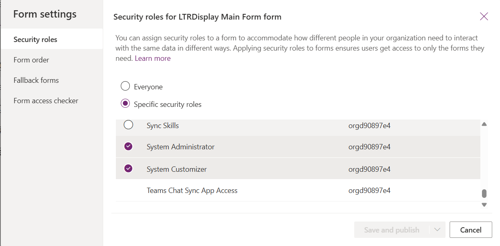
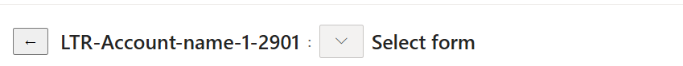
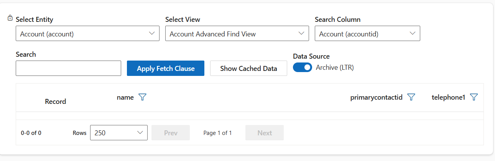
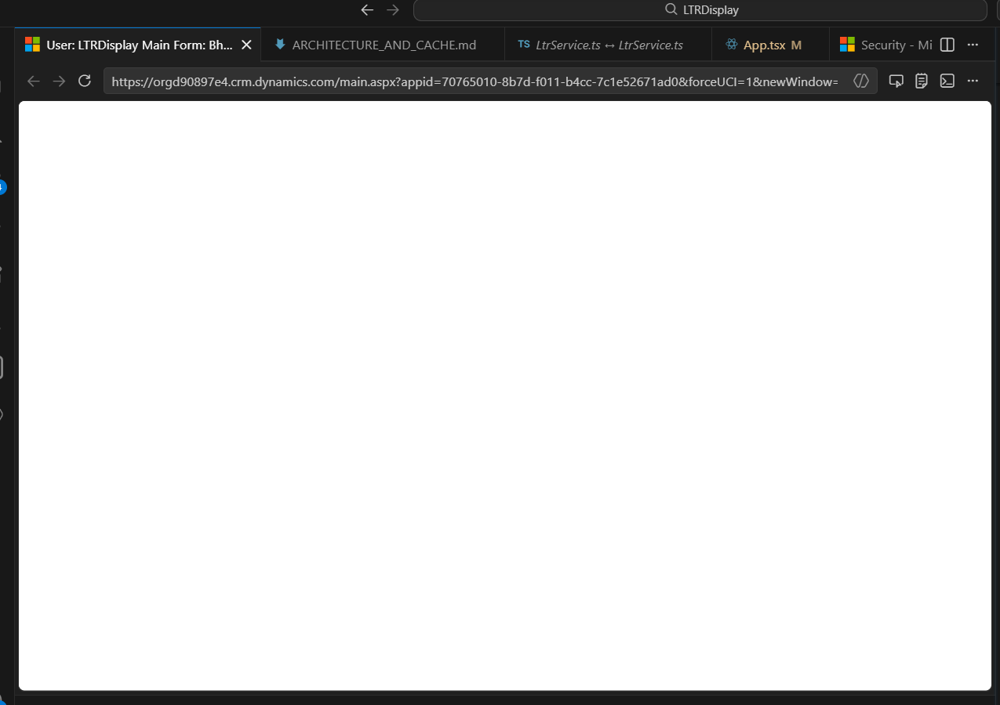

# LTRDisplay Design And Runtime Behavior

This document describes how the control is expected to behave in production and what customers should validate after importing the managed solution.

## 1. Data Source Model

- The control is archive-focused.
- The top data source toggle is removed from the UI.
- The control runs in archive mode and queries retained data.

## 2. View Clause And Fetch Behavior

- The selected Dataverse view FetchXML clause is used to fetch data from archive.
- The same selected view clause is also applied when projecting cached rows to the grid.
- Related-entity clauses inside the view are not used to fetch or filter related tab data.
- Related records are loaded using explicit relationship metadata and related-record fetch paths.

## 3. Fetch Archive vs Show Cached

- Fetch Archive:
  - Calls archive fetch with the selected view.
  - Stores results in user cache.
  - Grid then renders from cache projection.
- Show Cached:
  - Does not call archive fetch.
  - Reads from user cache only.
  - Applies selected view clause locally to cached rows before display.

## 4. User Cache Model

- Cache is per user.
- Cache persists in browser storage for the current user.
- Cache stores:
  - View result sets.
  - Entity record dictionary (record-by-id).
  - Related result sets.
  - Forms metadata.
  - Relationship metadata.
- Grid/form rendering paths prefer cache data once available.

## 5. Grid And Initial Load (Paging / nextLink)

- Archive fetch reads result pages and follows nextLink when returned by Dataverse.
- Records are accumulated page-by-page until:
  - no nextLink remains, or
  - maxRows is reached.
- After fetch, rows are cached and the grid renders from cached projection.
- Header filters and pagination are client-side against the projected grid rows.

## 6. Form Rendering And Form Selector

- The form selector lets users switch among available main forms for the current entity.
- Form layout is parsed from form metadata (tabs, sections, cells).
- Display values in the form are matched to metadata field definitions.
- Record Data tab shows key/value data using display labels where available from form metadata.

## 7. Related Records Tab

- Related data is lazy-loaded.
- Nothing is fetched until the user clicks Load/Reload for a selected relationship.
- Selecting a related row opens that record inside the same control.
- The control supports drill-down across related records.
- Back button returns to the previous detail context in the hierarchy stack.

## 8. Audit History Tab

- Audit is fetched from Dataverse audit rows for the selected record.
- Audit entries are mapped into row-level items with event grouping feel.
- The grid includes changed-on, changed-by, operation/action, attribute, and old/new values where present.
- For retain/delete-style events, attribute details may be unavailable; event rows are still shown.

## 9. Header / Command Bar / Header Tabs Visibility

- The control provides up/down controls.
- Default state is hidden.
- Supported Xrm form API is used first:
  - header body visibility
  - command bar visibility
  - header tab navigator visibility
- Unsupported DOM fallback has been removed by design.

## 10. Security And Packaging

- LTRDisplay Main Form is intended for admin access only.
- Form security roles should be configured to System Administrator only.
- Managed and unmanaged packages include:
  - the LTRDisplay custom control files
  - SystemUser form metadata with LTRDisplay control mapping
  - form display conditions including role id references

## 11. Customer Import Validation (Managed)

After importing managed solution:

- Confirm the form exists and is enabled.
- Confirm control mapping on SystemUser form points to ltr_LTRDisplay.LTRDisplayControl.
- Validate role-based form visibility:
  - System Administrator user can open the form.
  - Non-admin user does not receive this admin form.
- Validate Fetch Archive / Show Cached behavior and drill-down/back behavior.

## 12. SystemUser LTRDisplay Usage Video

Use this section to capture and share a real runtime walkthrough from the model-driven app.

### Embedded video (drop-in)

<video controls width="960" src="media/LTRDisplay_SystemUser_Usage.mp4">
  Your browser does not support embedded video. Use the direct file link below.
</video>

Direct link: [LTRDisplay SystemUser usage video](media/LTRDisplay_SystemUser_Usage.mp4)

### Recording checklist (2-4 minutes)

1. Open the model-driven app as a System Administrator.
2. Navigate to Users and open a user record on LTRDisplay Main Form.
3. Show that header/command chrome starts hidden and can be toggled with arrows.
4. Click Fetch Archive and wait for rows to load.
5. Switch to Show Cached and confirm cached replay works without refetch.
6. Open a record in the grid and show Record Data labels.
7. Open Audit History and show changed-on/by and old/new values.
8. Open Related Records, load one relationship, and demonstrate drill-down/back.
9. End by showing role-restricted behavior expectation (admin-only form).

### Notes

- Save the recording as: docs/media/LTRDisplay_SystemUser_Usage.mp4
- If repository size is a concern, keep the clip under 40 MB (H.264, 1080p).

### Screenshot walkthrough (UCI)

0. Initial form load (before running Fetch Archive):

1. Grid and actions after archive/cached usage:

2. Record Data tab after opening a selected row:

3. Audit History tab with changed values:

4. Related tab with relationship list and Load action:

### Additional screenshots (requested)

5. Initial Fetch Archive state (loading spinner and disabled controls):

6. Show Cached state with cached rows displayed in grid:

7. Form switcher menu expanded from selected record header:

8. Header and command bar shown after toggle (up-arrow action):

## 13. UCI Execution Trace (Playwright)

Execution date: 2026-03-17

Runtime target used:

- Entity: systemuser
- Mode: UCI runtime
- URL pattern: main.aspx with `pagetype=entityrecord`
- Record tested: `# AgCD-CSC-Prod` (`systemuserid=10fd400c-1821-f111-88b4-6045bda7ffa4`)

Actions executed in order:

1. Opened UCI Enabled Users list and navigated into the target user record.
2. Confirmed `Explorer - LTR` control rendered on the `LTRDisplay Main Form` in runtime.
3. Ran `Fetch Archive` and waited for completion.
4. Ran `Show Cached` and confirmed cached replay path is active.
5. Selected a returned Account row (`LTR-Account-name-1-2901`).
6. Opened `Record Data` tab and verified key/value output.
7. Opened `Audit History` tab and verified changed-on/by with old/new values.
8. Opened `Related` tab and verified relationship list with `Load` action.

Observed behavior:

- Initial fetch may show a short `Loading LTR Data...` period before controls re-enable.
- After selection, detailed form tabs are visible and interactive.
- Related tab loads relationship choices and allows explicit lazy load.

Note: This environment captures screenshots during automation but does not provide direct MP4 recording from the integrated browser toolchain. Use local desktop recording to generate `docs/media/LTRDisplay_SystemUser_Usage.mp4` while following Section 12.
