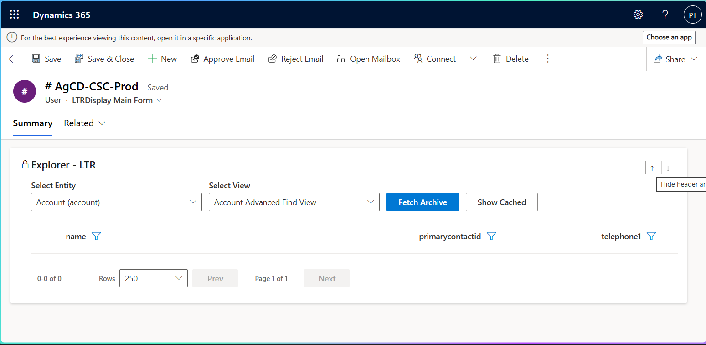
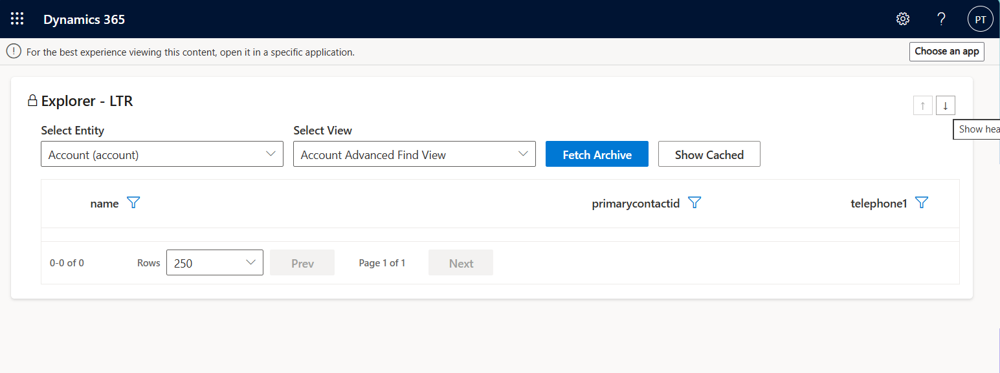
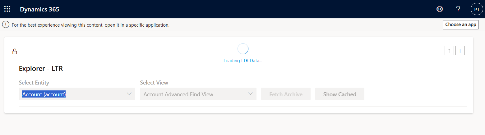
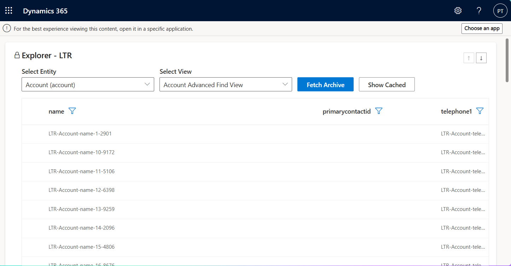
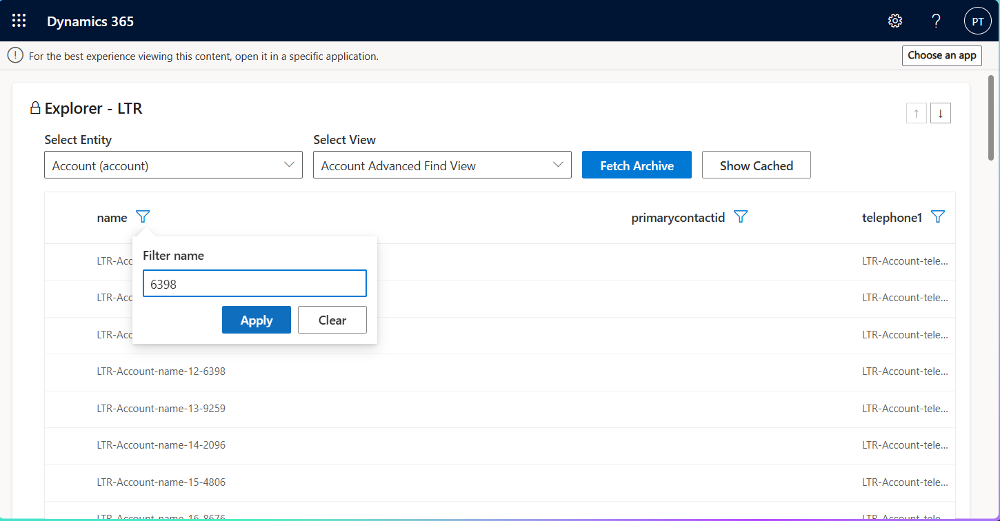
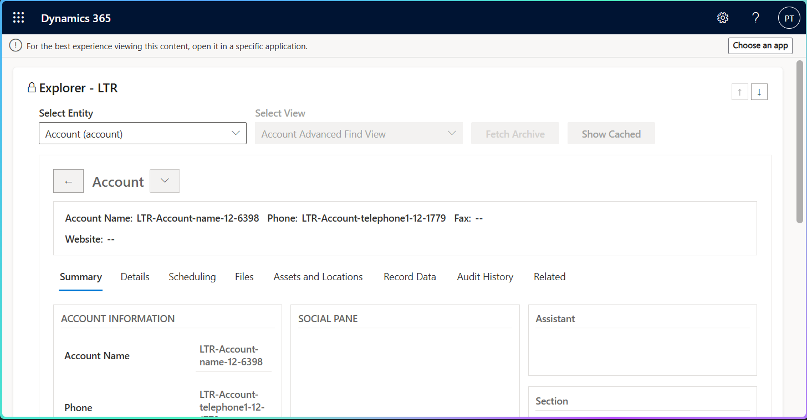
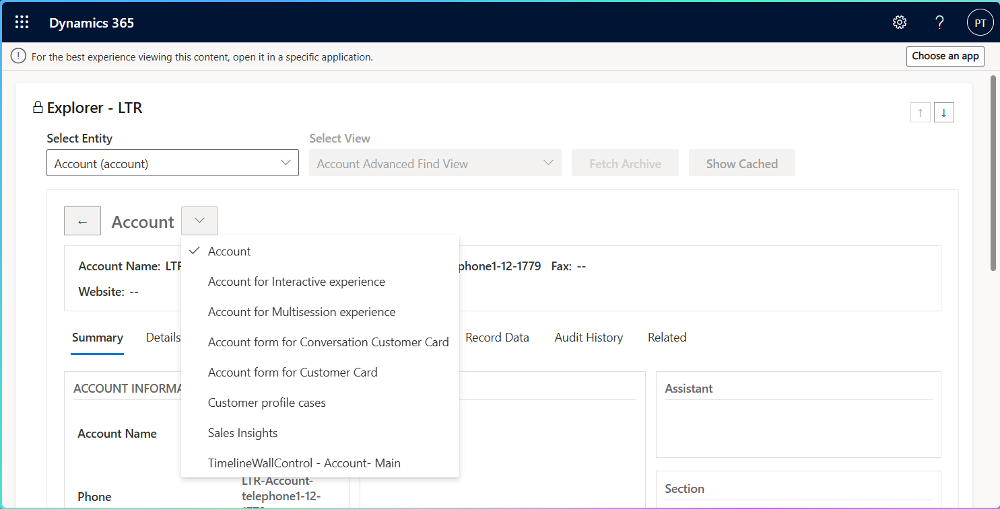
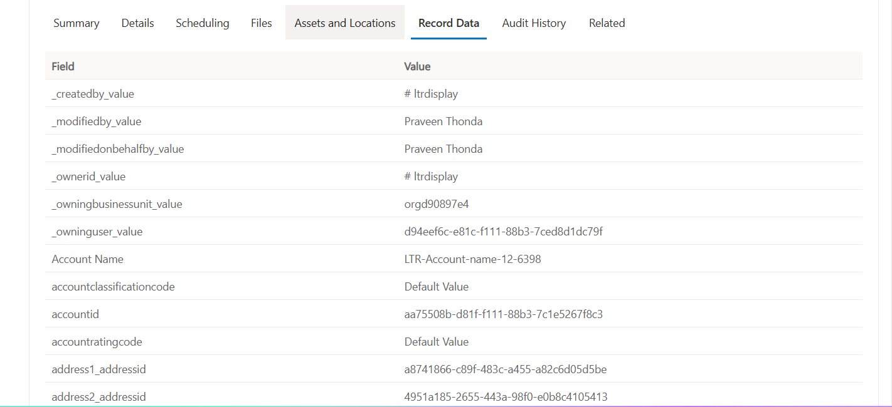
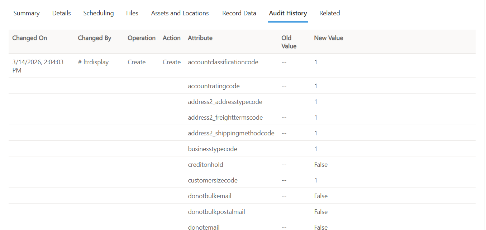
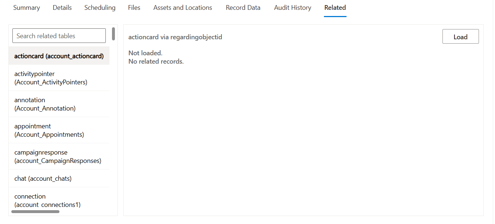

# LTRDisplay Control User Guide

This document explains how to use the LTRDisplay control in UCI with a 10-step visual walkthrough.

## Prerequisites

- You can open a System User record on the `LTRDisplay Main Form`.
- You have permission to read views/forms and related metadata.
- The control is configured with archive mode enabled.

## Step-by-Step Usage (10 images)

### 1. Form with header and command bar visible

This view shows the full UCI header plus the LTRDisplay control.

### 2. Form with header hidden inside LTRDisplay focus

Use the control toggle (up/down arrows) to switch form chrome visibility.

### 3. Fetch Archive loading state

Click `Fetch Archive`. While the request is running, the control shows `Loading LTR Data...` and disables actions.

### 4. Archive rows loaded in grid

After fetch completes, rows are displayed and can be browsed.

### 5. Apply a grid column filter

Use the column filter icon, enter a value, and click `Apply`.

### 6. Open a row to record detail

Select a row from the grid to open the detail area and tabs.

### 7. Use the form switcher

Open the form dropdown in detail mode to switch available forms.

### 8. Review Record Data tab

Open `Record Data` to inspect field/value pairs.

### 9. Review Audit History tab

Open `Audit History` to see change events with operation and value deltas.

### 10. Review Related tab and load relationship data

Open `Related`, select a relationship, then click `Load` when needed.

## Quick Behavior Notes

- `Fetch Archive` queries retained data and updates user cache.
- `Show Cached` reads from cache and applies local filtering.
- Related data is lazy-loaded only when requested.
- Audit output depends on Dataverse audit data availability.
